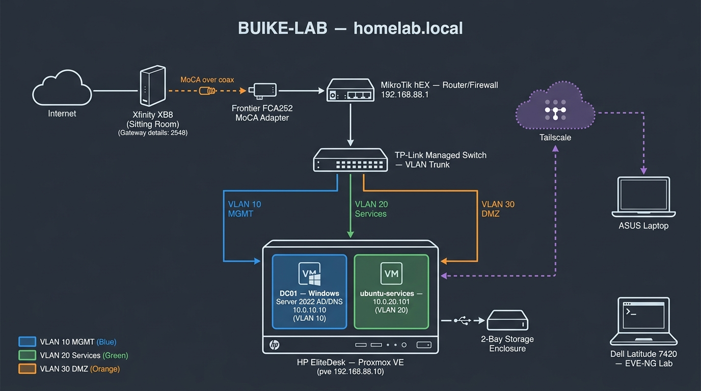
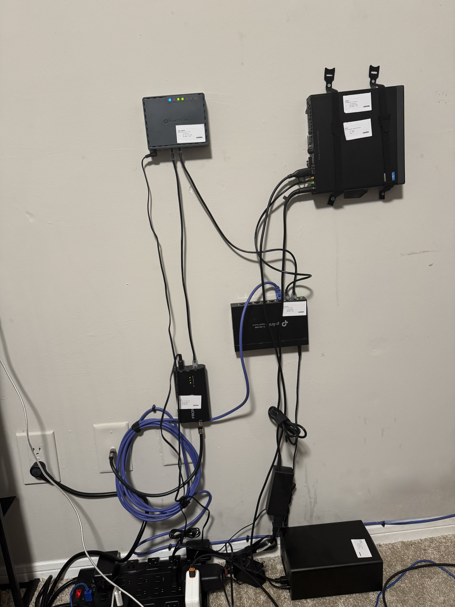

# BUIKE-LAB (homelab.local)

A hybrid home lab built on real hardware. Routing, switching, VLAN segmentation, virtualization, and Windows domain services, all configured by hand and documented like a production environment.

<p align="center">
  
  
</p>

<p align="center"><em>Left: logical topology. Right: the physical build, wall-mounted with printed asset labels on every device. MikroTik hEX (RTR-HEX01) top left, HP EliteDesk running Proxmox (PVE01) top right, TP-Link managed switch (SW-TPL01) center, MoCA adapter and storage enclosure below.</em></p>

---

## Why This Lab Exists

I am building toward network and cloud engineering roles, and I wanted hands-on experience you cannot get from a cloud trial. Every device here is physical hardware I bought, mounted, cabled, and configured myself. The router has no GUI shortcuts in my workflow. Everything on the MikroTik is done from the RouterOS CLI.

The lab also follows real operational practices: printed asset labels on every device, a documented cable schedule, and writeups for every build phase including what broke and how I fixed it.

---

## Hardware

| Asset ID | Device | Role | IP |
|---|---|---|---|
| RTR-HEX01 | MikroTik hEX | Router / Firewall | 192.168.88.1 |
| SW-TPL01 | TP-Link TL-SG108E | Managed switch, VLAN trunk | 192.168.88.x |
| PVE01 | HP EliteDesk Mini | Proxmox VE hypervisor host | 192.168.88.10 |
| MOCA01 | Frontier FCA252 | MoCA adapter, WAN delivery over room coax | Bridge |
| STOR01 | 2-Bay USB 3.0 Enclosure | Storage attached to PVE01 | N/A |
| LAB-EVE01 | Dell Latitude 7420 | EVE-NG lab host for Cisco simulation | Standalone |

Internet comes into the lab room over the existing coax run. The Xfinity gateway sits in the sitting room, and a MoCA adapter pair carries the connection to the MikroTik WAN port. Family devices stay on the Xfinity WiFi and never touch the lab network.

---

## Network Design

### VLANs

| VLAN | Name | Subnet | Purpose |
|---|---|---|---|
| 10 | Management | 10.0.10.0/24 | Domain controller, infrastructure management |
| 20 | Services | 10.0.20.0/24 | Application and service VMs |
| 30 | DMZ | 10.0.30.0/24 | Reserved for exposed services |

VLANs are tagged 802.1Q from the MikroTik through the TP-Link switch to the Proxmox host. Each VLAN has its own DHCP pool on the router, and firewall rules control what can talk to what between zones.

### Virtual Machines

| VM ID | Hostname | OS | IP | VLAN |
|---|---|---|---|---|
| 100 | ubuntu-services | Ubuntu Server 24.04 | 10.0.20.101 | 20 |
| 101 | DC01 | Windows Server 2022 | 10.0.10.10 | 10 |

DC01 is promoted to domain controller for **homelab.local**, running AD DS and DNS with an OU structure for Employees, Workstations, Groups, and Service Accounts.

### Remote Access

Tailscale connects the lab to my laptop from anywhere. I originally planned a WireGuard tunnel, but Xfinity puts residential connections behind CGNAT, so there is no public IP to receive inbound connections. Tailscale solved it because both ends dial out. That failure and the reasoning are documented in the remote access writeup.

---

## Operational Practices

**Asset labels.** Every device carries a printed label with its asset ID, hostname, IP, and role. You can see them in the build photo. Label sources live in [`assets/`](assets/).

**Cable schedule.** Every cable run is numbered and documented, from COAX-1 (the MoCA run from the sitting room) through CAB-01 to CAB-03 (the Ethernet runs between router, switch, and host).

| Cable ID | From | To | Type |
|---|---|---|---|
| COAX-1 | Xfinity gateway (sitting room) | Frontier FCA252 | Coax (MoCA) |
| CAB-01 | FCA252 | RTR-HEX01 WAN | Cat6 |
| CAB-02 | RTR-HEX01 | SW-TPL01 (trunk) | Cat6 |
| CAB-03 | SW-TPL01 | PVE01 | Cat6 |

**Ticketing (planned).** The next phase adds GLPI so every lab incident gets logged as a ticket with a root cause and resolution.

---

## Build Phases

| Phase | Scope | Status |
|---|---|---|
| 1. Core Build | MoCA WAN delivery, MikroTik CLI config, switch, Proxmox install | Complete |
| 2. VLAN Segmentation | 802.1Q trunking, per-VLAN DHCP, inter-VLAN firewall rules | Complete |
| 3. Domain Services | Windows Server 2022 VM, DC promotion, AD DS, DNS, OU structure | Complete |
| 4. Remote Access | Tailscale mesh after CGNAT killed the WireGuard plan | Complete |
| 5. Documentation & Labeling | Topology diagram, asset labels, cable schedule | Complete |
| 6. Enterprise Simulation | Fictional company: EVE-NG campus + Azure-hosted AD over site-to-site VPN | In Progress |
| 7. Monitoring & Ticketing | GLPI ticketing, SNMP/flow monitoring | Planned |

Each completed phase has its own writeup in [`docs/`](docs/).

---

## Things That Broke

A few highlights, with full details in the phase writeups:

- **WireGuard behind CGNAT.** No public IP on Xfinity residential service means inbound tunnels are dead on arrival. Switched to Tailscale, which establishes connections outbound from both sides.
- **VT-x blocked on the EVE-NG laptop.** Windows Virtualization Based Security and Credential Guard were holding the virtualization extensions hostage, so VMware could not pass them to EVE-NG. Fixed with Microsoft's DG Readiness Tool.

---

## Repo Structure

```
.
├── README.md
├── images/          Topology diagram, build photos
├── docs/            Phase writeups (core build, VLANs, AD DS, remote access)
├── configs/         Sanitized MikroTik exports and switch settings
└── assets/          Asset label sources (SVG/PDF) and cable schedule
```

---

*Built and maintained by Chibuike "BK" Okerulu. Network+ certified, AZ-104 in progress.*
