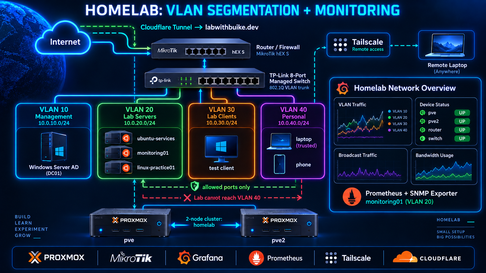
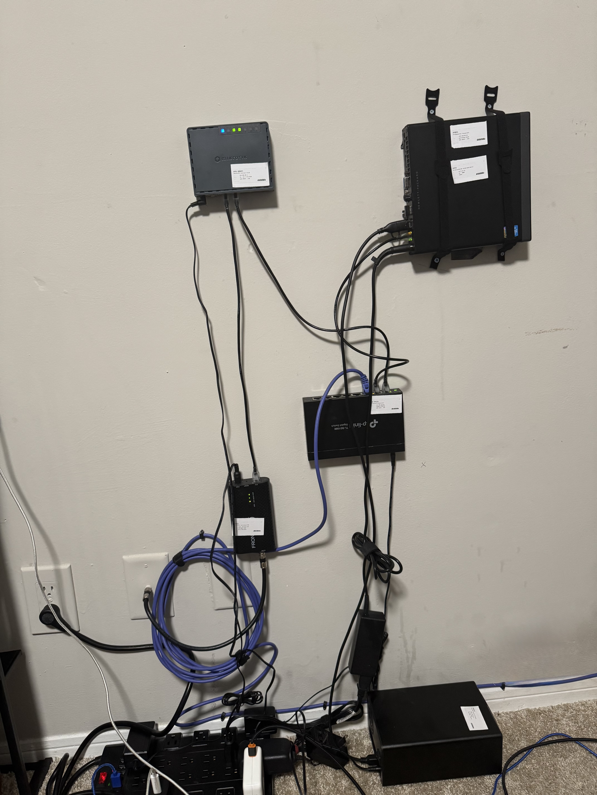

# Homelab: VLAN Segmentation + Monitoring



I rebuilt my homelab's network segmentation from scratch, added a dedicated personal VLAN with one-way trust isolation, provisioned three new Ubuntu Server VMs, stood up a full monitoring stack (Prometheus + SNMP Exporter + Grafana), and extended remote access over Tailscale into the lab subnet.

## Stack

- **Router/Firewall:** MikroTik hEX S (RouterOS 7.20.7)
- **Switch:** TP-Link TL-SG108E (802.1Q managed)
- **Hypervisor:** Proxmox VE 9.2.2, single node, HP EliteDesk 800 G1 (i5-4590T, 16GB RAM)
- **Monitoring:** Prometheus, SNMP Exporter, Grafana (all bare-metal systemd services, no containers)
- **Remote access:** Tailscale, with subnet routing into the lab VLAN

## Starting point

Before this build, my MikroTik hEX S was already routing three VLANs on the Proxmox host:

<table>
<tr><th>VLAN</th><th>Subnet</th><th>Purpose</th></tr>
<tr><td>10</td><td>10.0.10.0/24</td><td>Management</td></tr>
<tr><td>20</td><td>10.0.20.0/24</td><td>Lab servers</td></tr>
<tr><td>30</td><td>10.0.30.0/24</td><td>Lab clients</td></tr>
</table>

My personal devices (laptop, phone) shared the untagged bridge network (192.168.88.0/24) with no isolation from the lab at all. That was the first thing I set out to fix.

## Phase 1: Adding a personal VLAN with one-way trust

The goal: my laptop should be able to reach into the lab to manage it, but nothing in the lab should be able to reach back out to my laptop.

### Renaming the existing VLANs

First I renamed the existing VLAN interfaces on the MikroTik to be more descriptive:

```
/interface vlan set [find name=vlan10-mgmt] name=vlan10-management
/interface vlan set [find name=vlan20-services] name=vlan20-lab-servers
/interface vlan set [find name=vlan30-dmz] name=vlan30-lab-clients
```

I kept the existing 10.0.x.0/24 addressing rather than renumbering to match a reference architecture doc I'd been using for planning, which used 10.10.x.0/24. Renumbering would have meant touching DHCP scopes and static IPs on my domain controller for no real benefit.

### Building VLAN 40

Created the new VLAN on the same trunk interface, with its own subnet, address, and DHCP pool:

```
/interface vlan add interface=ether2 name=vlan40-personal vlan-id=40
/ip address add address=10.0.40.1/24 interface=vlan40-personal network=10.0.40.0
/ip pool add name=pool-vlan40 ranges=10.0.40.100-10.0.40.200
/ip dhcp-server add address-pool=pool-vlan40 interface=vlan40-personal name=dhcp-vlan40
/ip dhcp-server network add address=10.0.40.0/24 dns-server=10.0.40.1 gateway=10.0.40.1
```

### Trusted device setup

I reserved a fixed IP for my laptop's MAC address and added it to a trusted address list, so the firewall rules could reference "my laptop specifically" rather than the whole VLAN 40 subnet:

```
/ip dhcp-server lease add address=10.0.40.10 mac-address=C8:A3:62:04:C8:2E server=dhcp-vlan40 comment="trusted-laptop"
/ip firewall address-list add address=10.0.40.10 list=trusted-lab-access comment="trusted laptop"
```

### Firewall isolation

Built an address list for the lab networks, then three rules: trusted device to lab is allowed but only on specific ports, anything else on VLAN 40 to the lab is blocked, and lab to VLAN 40 is blocked in every direction:

```
/ip firewall address-list add address=10.0.10.0/24 list=lab-networks comment="mgmt"
/ip firewall address-list add address=10.0.20.0/24 list=lab-networks comment="lab-servers"
/ip firewall address-list add address=10.0.30.0/24 list=lab-networks comment="lab-clients"

/ip firewall filter add action=accept chain=forward src-address-list=trusted-lab-access dst-address-list=lab-networks protocol=tcp dst-port=22,8291,3389,80,443,3000,9090 comment="trusted device to lab - allowed ports"
/ip firewall filter add action=drop chain=forward src-address=10.0.40.0/24 dst-address-list=lab-networks comment="vlan40 to lab - block untrusted"
/ip firewall filter add action=drop chain=forward src-address-list=lab-networks dst-address=10.0.40.0/24 comment="lab to vlan40 - block"
```

I went with allowing only specific management ports (SSH, Winbox, RDP, plus common web ports for anything I'd want to check in a browser) rather than the whole subnet, since a fully open personal-to-lab rule would mean a compromised laptop has unrestricted access to everything in the lab, not just the tools I actually use to manage it.

### Physical switch config

This is where I found something I hadn't expected: 802.1Q VLAN filtering had never actually been enabled on my TP-Link TL-SG108E switch. The router-side VLANs had apparently been working through some other path, but the switch itself was passing everything through flat.

I enabled 802.1Q VLAN mode on the switch and built out all four VLANs properly:

<table>
<tr><th>VLAN</th><th>Port 1 (MikroTik)</th><th>Port 2 (EliteDesk)</th><th>Port 3 (laptop)</th></tr>
<tr><td>10</td><td>Tagged</td><td>Tagged</td><td>Not member</td></tr>
<tr><td>20</td><td>Tagged</td><td>Tagged</td><td>Not member</td></tr>
<tr><td>30</td><td>Tagged</td><td>Tagged</td><td>Not member</td></tr>
<tr><td>40</td><td>Tagged</td><td>Not member</td><td>Untagged</td></tr>
</table>

Then set Port 3's PVID to 40, so untagged frames arriving from my laptop get classified onto VLAN 40:

Switch web UI: 802.1Q PVID Setting → Port 3 → PVID 40 → Apply.

### The lockout

After making this change, I lost SSH and Winbox access to the router entirely, from any device on VLAN 40, including my laptop.

Root cause: none of the four VLAN interfaces were members of the router's `LAN` interface list, and the router's default input-chain firewall rule drops anything not arriving from an interface on that list. This wasn't unique to VLAN 40, it affected all four VLANs, I just hadn't noticed with 10/20/30 because I'd never tried to SSH into the router directly from any of them before.

Recovery: I moved my laptop's cable to an untouched switch port still on the old untagged network (192.168.88.0/24), which still had router access since the `bridge` interface was in the `LAN` list. From there I added all four VLAN interfaces to the list:

```
/interface list member add interface=vlan10-management list=LAN
/interface list member add interface=vlan20-lab-servers list=LAN
/interface list member add interface=vlan30-lab-clients list=LAN
/interface list member add interface=vlan40-personal list=LAN
```

Moved my laptop back to Port 3, and everything worked as intended: my laptop reachable into the lab on management ports, nothing in the lab able to reach back.

## Phase 1.5: Static IP reservations

Once everything was working, I locked in static DHCP reservations for the lab devices so their IPs would never drift on lease renewal, including for VMs provisioned later in this build:

```
/ip dhcp-server lease add address=10.0.20.108 mac-address=BC:24:11:C6:6C:CE server=dhcp-vlan20 comment="ubuntu-services"
/ip dhcp-server lease add address=10.0.20.109 mac-address=BC:24:11:6B:34:84 server=dhcp-vlan20 comment="monitoring01"
/ip dhcp-server lease add address=10.0.20.107 mac-address=BC:24:11:62:14:D3 server=dhcp-vlan20 comment="linux-practice01"
/ip dhcp-server lease add address=10.0.20.110 mac-address=0C:EF:15:05:DB:31 server=dhcp-vlan20 comment="TL-SG108E-switch"
```

## Physical setup

<details>
<summary>Wall-mounted rack (click to expand)</summary>



MikroTik hEX S (top left), HP EliteDesk 800 G1 running Proxmox (top right, wall-mounted), TP-Link TL-SG108E switch (center), Frontier ONT (below the MikroTik).

</details>

## Phase 2: Provisioning the VMs

I cleared out old VMs and provisioned three fresh Ubuntu Server 26.04 VMs via a bash script on the Proxmox host, using `qm create`:

<table>
<tr><th>VM</th><th>ID</th><th>Specs</th><th>Purpose</th></tr>
<tr><td>ubuntu-services</td><td>102</td><td>2 vCPU / 2GB RAM / 60GB</td><td>General services, planned NAS/Samba</td></tr>
<tr><td>monitoring01</td><td>103</td><td>2 vCPU / 2GB RAM / 30GB</td><td>Monitoring stack</td></tr>
<tr><td>linux-practice01</td><td>104</td><td>1 vCPU / 1GB RAM / 30GB</td><td>Disposable Linux practice sandbox</td></tr>
</table>

The 4-core host CPU meant these three VMs alone (5 vCPU assigned) already oversubscribed the physical core count, which is fine since Proxmox timeslices and none of them need to be under heavy load simultaneously.

`linux-practice01`'s installer hung on "downloading and installing security updates" for over five minutes with 1GB RAM. I bumped it to 2GB and restarted the install, which resolved it. Likely the installer process plus package unpacking needed more headroom than 1GB comfortably provided.

All three came up correctly on VLAN 20 with the expected hostnames, confirmed with `hostnamectl status` on each.

## Phase 3: Monitoring stack

I chose Prometheus, SNMP Exporter, and Grafana over Zabbix. Zabbix is arguably more turnkey for pure SNMP polling, but this stack is closer to what I'll actually run into in cloud-focused work, which fits my current AWS-first cert path better.

### Prometheus

Installed via binary (not the snap package, for config flexibility) with a script that auto-detects the latest release version. Created a dedicated `prometheus` system user with no login shell, standard practice for service accounts.

First run failed. The script used `set -e` and died partway through when `mv consoles/` failed, since that Prometheus release no longer ships the legacy `consoles/` folder. That meant `prometheus.yml` never got moved into `/etc/prometheus/`, and systemd showed the service as briefly "active" right after each restart before it crashed on the missing config file. I only saw the actual error clearly with `journalctl -u prometheus`, since the live `systemctl status` output truncated the message. Fixed by manually moving the config file over.

```
[Unit]
Description=Prometheus Monitoring
Wants=network-online.target
After=network-online.target

[Service]
User=prometheus
Group=prometheus
Type=simple
ExecStart=/usr/local/bin/prometheus \
  --config.file /etc/prometheus/prometheus.yml \
  --storage.tsdb.path /var/lib/prometheus/

[Install]
WantedBy=multi-user.target
```

### SNMP Exporter

My install script hardcoded a version that was already out of date. I started checking the GitHub API for the actual latest release before downloading, going forward, and installed v0.30.1.

Enabled SNMP on the MikroTik:

```
/snmp set enabled=yes
/snmp community set [find default=yes] name=public
```

Tested the full chain manually before wiring it into Prometheus:

```bash
curl "http://localhost:9116/snmp?target=10.0.10.1&module=if_mib"
```

This returned real interface data for every VLAN and physical port, confirming SNMP Exporter could successfully query the router.

### Wiring Prometheus to SNMP Exporter

Added a scrape job to `prometheus.yml` that routes the actual SNMP query through the exporter via relabeling, which is the standard pattern for any Prometheus exporter that proxies to a third-party device:

```yaml
  - job_name: 'mikrotik'
    static_configs:
      - targets:
          - 10.0.10.1
    metrics_path: /snmp
    params:
      module: [if_mib]
    relabel_configs:
      - source_labels: [__address__]
        target_label: __param_target
      - source_labels: [__param_target]
        target_label: instance
      - target_label: __address__
        replacement: localhost:9116
```

Confirmed via Prometheus's own Targets page that both jobs (self-monitoring and MikroTik) showed UP.

### Grafana

Install failed the first time because the GPG key download for the apt repo came back empty, so apt correctly refused to trust an unsigned source. Re-ran the key import using `gpg --dearmor` properly instead of assuming the raw curl output would work as a valid keyring:

```bash
wget -q -O - https://apt.grafana.com/gpg.key | gpg --dearmor | sudo tee /usr/share/keyrings/grafana.key > /dev/null
```

After that, install and service start went cleanly. Connected Grafana to Prometheus as a data source (`http://localhost:9090`, confirmed with "Successfully queried the Prometheus API"), then built a dashboard with panels for:

- VLAN interface traffic rate (`rate(ifHCInOctets{ifName=~"vlan.*"}[5m])`)
- Interface status (`ifOperStatus{ifName=~"vlan.*"}`)
- Broadcast packet rate (`rate(ifHCInBroadcastPkts{ifName=~"vlan.*"}[5m])`)
- Bandwidth gauge (`rate(ifHCInOctets{ifName=~"vlan.*"}[5m]) * 8`)

### TP-Link switch SNMP

Checked whether the TL-SG108E supports SNMP so I could monitor it too. It's TP-Link's budget "Easy Smart" tier, one step below their SNMP-capable JetStream line, and there's no SNMP menu anywhere in its web UI. I'm treating this as a confirmed hardware limitation rather than something to work around.

## Phase 4: Remote access

I'd set up Tailscale on this host previously, but when I checked, it wasn't actually installed anymore, likely lost during an earlier Proxmox VE version migration. Reinstalled and reauthenticated:

```bash
curl -fsSL https://tailscale.com/install.sh | sh
tailscale up
```

To reach the lab VMs over Tailscale without installing it on each one individually, I advertised the lab subnet from the host:

```bash
tailscale up --advertise-routes=10.0.20.0/24
```

Approved the route in the Tailscale admin console. It didn't work at first, traffic just silently failed to route, because IP forwarding was disabled on the host by default. Tailscale warns about this during `up` but doesn't block the command on it. Fixed by explicitly enabling it:

```
net.ipv4.ip_forward = 1
net.ipv6.conf.all.forwarding = 1
```

in `/etc/sysctl.d/99-tailscale.conf`, applied with `sysctl -p`. After that, I could SSH into any of the lab VMs from my laptop over Tailscale regardless of which network I was physically on.

## Where things stand

<table>
<tr><th>System</th><th>Access</th></tr>
<tr><td>Proxmox host</td><td><code>ssh root@192.168.88.10</code> (local) or <code>ssh root@100.79.197.10</code> (Tailscale, anywhere)</td></tr>
<tr><td>ubuntu-services</td><td><code>ssh buike-lab@10.0.20.108</code></td></tr>
<tr><td>monitoring01</td><td><code>ssh buike-lab@10.0.20.109</code> (Tailscale-reachable via subnet route)</td></tr>
<tr><td>linux-practice01</td><td><code>ssh buike-lab@10.0.20.107</code> (Tailscale-reachable via subnet route)</td></tr>
<tr><td>MikroTik</td><td><code>ssh admin@10.0.10.1</code></td></tr>
</table>

## Design decisions

**Kept the existing 10.0.x.0/24 addressing** instead of matching a reference doc's 10.10.x.0/24 scheme. Renumbering working VLANs for no functional gain wasn't worth the disruption to DHCP scopes and static IPs already built on top of them.

**Folded the planned NAS/Samba VM into ubuntu-services** rather than running it as a separate VM. With only 16GB of host RAM and four other VMs already running, this was a deliberate resource trade-off rather than following the original plan literally.

**Restricted personal-to-lab access to specific management ports** rather than allowing the whole VLAN 40 subnet through. A fully open rule would mean a compromised laptop has unrestricted access to everything in the lab.

**Built the monitoring stack bare-metal instead of in Docker.** This meant actually working through real systemd behavior, config file paths, and service dependencies by hand, rather than having Docker abstract that away. Worth revisiting as a containerized rebuild later, now with an actual understanding of what's happening underneath.

## Things that broke

- Forgot the MikroTik admin password partway through. Recovered via Winbox's MAC-based connection instead of a factory reset, which would have wiped the whole existing VLAN/firewall config.
- A `!` in a new password broke RouterOS's terminal parser, since it treats `!` specially outside quotes.
- Adding VLAN 40 locked me out of the router entirely from any VLAN, not just the new one, because none of the VLAN interfaces were in the router's `LAN` interface list.
- Prometheus crash-looped on first start because the install script's `mv` command silently failed on a folder that no longer exists in newer releases, leaving the config file in the wrong place.
- SNMP Exporter install script had a stale hardcoded version.
- Grafana's apt repo key failed signature verification because the initial key download was empty.
- Tailscale had gone missing from the host at some point after being set up previously.
- Tailscale's subnet route was approved but non-functional until I manually enabled IP forwarding on the host.
- `linux-practice01`'s installer hung for 5+ minutes on 1GB RAM before I bumped it to 2GB.

## What's still open

- Actually building the Samba/NAS share on `ubuntu-services`
- Site-to-site VPN and automated encrypted backups to AWS S3
- Using `linux-practice01` for something
